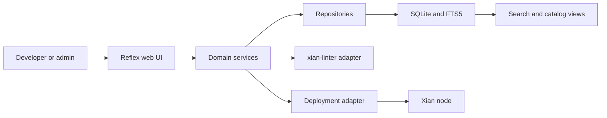

# xian-contracting-hub-web

`xian-contracting-hub-web` is the curated smart-contract hub for the Xian
ecosystem. It is a Reflex-based web app where developers browse, search,
inspect, rate, and deploy Xian contracts, and where admins curate the
catalog. Contracts are stored as immutable append-only versions in a
SQLite database; full-text search uses SQLite FTS5; lint and deployment
flows are mediated through adapter integrations.

## Catalog Flow



## Quick Start

```bash
# Python 3.14 virtual environment
python3.14 -m venv .venv
source .venv/bin/activate

# Project + dev dependencies
pip install -e ".[dev]"

# Playwright browsers (used by e2e tests)
playwright install chromium

# Environment config
cp .env.example .env

# Database initialization and migration
reflex db init
reflex db migrate

# Dev server (defaults to http://localhost:3000)
reflex run
```

For a production-ready static export:

```bash
reflex export --no-zip
```

## Principles

- **Curated, append-only catalog.** Contract versions are immutable
  snapshots; new releases create new rows. History is never rewritten.
- **Search is first-class.** SQLite FTS5 indexes contract names,
  descriptions, authors, tags, and categories. The catalog UX is built
  around it.
- **Adapters around external integrations.** The contract linter,
  playground deploy target, and storage layer sit behind adapters under
  `integrations/` so the UI stays stable when those integrations change.
- **Custom auth, no Reflex Enterprise.** Email / password sessions with
  secure cookies; no third-party identity provider.
- **Layered code.** `pages/` and `states/` orchestrate the UI; business
  logic lives in `services/`; data access lives in `repositories/`.
  Models stay thin.

## Capabilities

- browse and search curated Xian contracts (full-text search,
  category / tag filters, multiple sort orders)
- inspect contracts with syntax-highlighted Python source, version
  diffs, lint reports, and related-contract navigation
- developer engagement: star contracts, submit ratings, save playground
  targets, deploy versions
- admin workspace: create / edit contracts, publish versions, map
  relations, curate featured content
- track deployment history and a developer leaderboard across the
  catalog

## Tech Stack

| Layer            | Tool                  | Version            |
| ---------------- | --------------------- | ------------------ |
| Runtime          | Python                | 3.11+ / 3.14 venv  |
| Framework        | Reflex                | 0.8.x              |
| ORM              | SQLModel              | 0.0.x              |
| Database         | SQLite (FTS5)         | 3.52+              |
| Migrations       | Alembic               | 1.18+              |
| Contract linting | `xian-linter`         | 0.2+               |
| Xian SDK         | `xian-py`             | 0.4+               |
| Tests            | `pytest`, Playwright  | 9.x / 1.58+        |
| Lint / format    | Ruff                  | 0.15+              |

## Key Directories

- `contracting_hub/` — Reflex app:
  - `app.py`, `contracting_hub.py` — app assembly and route registration.
  - `config.py`, `theme.py` — runtime settings, design tokens.
  - `pages/`, `components/`, `states/` — route-level pages, reusable UI,
    state machines.
  - `models/` — SQLModel schema definitions.
  - `repositories/` — data-access layer.
  - `services/` — domain logic (auth, search, diffs, ratings, deploy).
  - `integrations/` — external adapters (`xian-linter`, playground,
    storage).
  - `admin/` — admin workspace pages.
  - `utils/` — helpers and shared metadata.
- `tests/` — `unit/`, `integration/`, `e2e/` (Playwright).
- `migrations/` — Alembic migration scripts.
- `assets/` — static CSS and public assets.
- `uploads/`, `uploaded_files/` — runtime upload areas.
- `rxconfig.py` — Reflex runtime configuration.
- `pyproject.toml`, `uv.lock`, `alembic.ini` — packaging, dependency
  lock, migration config.

## Configuration

Key environment variables (full list in `.env.example`):

- `CONTRACTING_HUB_ENV` — `development` or `production`
- `CONTRACTING_HUB_DB_PATH` — SQLite database file path
- `CONTRACTING_HUB_BOOTSTRAP_ADMIN_*` — optional admin seed credentials

## Validation

```bash
ruff check .
ruff format --check .

pytest -x -q --timeout=30                          # full suite
pytest -x -q --timeout=30 tests/unit
pytest -x -q --timeout=30 tests/integration
pytest -x -q --timeout=30 tests/e2e
pytest --cov=contracting_hub --cov-report=term-missing --cov-fail-under=80
```

## Related Repos

- [`../xian-linter/README.md`](../xian-linter/README.md) — contract linter consumed by the hub
- [`../xian-py/README.md`](../xian-py/README.md) — Python SDK used for chain reads / deploys
- [`../xian-playground-web/README.md`](../xian-playground-web/README.md) — playground that the hub can target for "deploy to playground"
