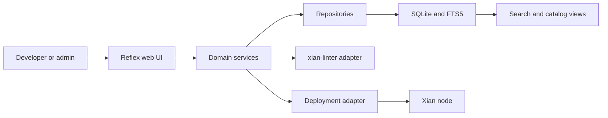

# xian-contracting-hub-web

`xian-contracting-hub-web` is the curated smart-contract hub for the Xian
ecosystem. It is a Reflex-based web app where developers browse, search,
inspect, rate, and deploy Xian contracts, and where admins curate the
catalog. Contracts are stored as immutable append-only versions in a
SQLite database; full-text search uses SQLite FTS5; lint and deployment
flows are mediated through adapter integrations.

## Catalog Flow



## Quick Start

```bash
# Project + dev dependencies
uv sync --extra dev

# Playwright browsers (used by e2e tests)
uv run playwright install chromium

# Environment config
cp .env.example .env

# Database initialization and migration
uv run reflex db init
uv run reflex db migrate

# Dev server (defaults to http://localhost:3000)
uv run reflex run
```

For a production-ready static export:

```bash
uv run reflex export --no-zip
```

## Principles

- **Curated, append-only catalog.** Contract versions are immutable
  snapshots; new releases create new rows. History is never rewritten.
- **Presentation, not source ownership.** The hub presents curated releases
  from their canonical owner repos. Reusable standalone packages may come
  from `xian-contracts`; product-owned systems such as the DEX stay in their
  product repos and are imported from pinned manifests.
- **Search is first-class.** SQLite FTS5 indexes contract names,
  descriptions, authors, tags, and categories. The catalog UX is built
  around it.
- **Adapters around external integrations.** The contract linter,
  playground deploy target, and storage layer sit behind adapters under
  `integrations/` so the UI stays stable when those integrations change.
- **Custom auth, no Reflex Enterprise.** Email / password sessions with
  secure cookies; no third-party identity provider.
- **Layered code.** `pages/` and `states/` orchestrate the UI; business
  logic lives in `services/`; data access lives in `repositories/`.
  Models stay thin.

## Capabilities

- browse and search curated Xian contracts (full-text search,
  category / tag filters, multiple sort orders)
- inspect contracts with syntax-highlighted Python source, version
  diffs, lint reports, and related-contract navigation
- developer engagement: star contracts, submit ratings, save playground
  targets, deploy versions
- admin workspace: create / edit contracts, publish versions, map
  relations, curate featured content
- track deployment history and a developer leaderboard across the
  catalog

## Source Ownership and Imports

The hub should not be the canonical source repository for curated contracts.
It is the public registry and review surface. Source ownership stays with the
repo that naturally owns the release cycle:

- `xian-contracts` owns reusable standalone contract packages, standards,
  adapters, and examples.
- Product repos own tightly coupled product systems, for example
  `xian-dex` owns its contracts, frontend, bootstrap script, tests, and
  `contract-bundle.json`.
- Network-level system packaging belongs outside the hub, for example in
  `xian-configs`.

The hub imports from those owners into SQLite as immutable release snapshots.
Package and release metadata model both standalone contracts and product-scale
systems:

- `contract_packages` identify the source owner or product package.
- `contract_package_releases` identify pinned releases, including source repo,
  commit or tag, manifest path, and manifest hash.
- `contract_package_release_artifacts` link one package release to the immutable
  `contract_versions` that the hub already displays and deploys.

For a DEX-style repo, `contract-bundle.json` is the import contract: the hub
should verify the manifest hash and per-contract source hashes, then store the
corresponding source snapshots and artifact links. Page rendering should read
from the hub database, not from live GitHub requests.

See [`docs/catalog-model.md`](docs/catalog-model.md) for the package / release /
artifact distinction and how bundle-style manifests map into the simplified
database model.

## Production Storage

SQLite is the default and is sufficient for the expected hub workload: small
curated release data, catalog search, admin curation, ratings, and deployment
history. Production deployments should put the SQLite database and upload
directory on persistent storage and back them up. Move to Postgres only if the
hub needs multi-writer operational scale, external BI access, or stronger
managed database operations than a single-server SQLite deployment provides.

## Tech Stack

| Layer            | Tool                  | Version            |
| ---------------- | --------------------- | ------------------ |
| Runtime          | Python                | 3.11+ / 3.14 venv  |
| Framework        | Reflex                | 0.8.x              |
| ORM              | SQLModel              | 0.0.x              |
| Database         | SQLite (FTS5)         | 3.52+              |
| Migrations       | Alembic               | 1.18+              |
| Contract linting | `xian-linter`         | 0.2+               |
| Xian SDK         | `xian-py`             | 0.4+               |
| Tests            | `pytest`, Playwright  | 9.x / 1.58+        |
| Lint / format    | Ruff                  | 0.15+              |

## Key Directories

- `contracting_hub/` — Reflex app:
  - `app.py`, `contracting_hub.py` — app assembly and route registration.
  - `config.py`, `theme.py` — runtime settings, design tokens.
  - `pages/`, `components/`, `states/` — route-level pages, reusable UI,
    state machines.
  - `models/` — SQLModel schema definitions.
  - `repositories/` — data-access layer.
  - `services/` — domain logic (auth, search, diffs, ratings, deploy).
  - `integrations/` — external adapters (`xian-linter`, playground,
    storage).
  - `admin/` — admin workspace pages.
  - `utils/` — helpers and shared metadata.
- `tests/` — `unit/`, `integration/`, `e2e/` (Playwright).
- `migrations/` — Alembic migration scripts.
- `assets/` — static CSS and public assets.
- `uploads/`, `uploaded_files/` — runtime upload areas.
- `rxconfig.py` — Reflex runtime configuration.
- `pyproject.toml`, `uv.lock`, `alembic.ini` — packaging, dependency
  lock, migration config.

## Configuration

Key environment variables (full list in `.env.example`):

- `CONTRACTING_HUB_ENV` — `development` or `production`
- `CONTRACTING_HUB_DB_PATH` — SQLite database file path
- `CONTRACTING_HUB_BOOTSTRAP_ADMIN_*` — optional admin seed credentials

## Validation

```bash
ruff check .
ruff format --check .

pytest -x -q --timeout=30                          # full suite
pytest -x -q --timeout=30 tests/unit
pytest -x -q --timeout=30 tests/integration
pytest -x -q --timeout=30 tests/e2e
pytest --cov=contracting_hub --cov-report=term-missing --cov-fail-under=80
```

## Related Docs

- [`../xian-linter/README.md`](../xian-linter/README.md) — contract linter consumed by the hub
- [`../xian-py/README.md`](../xian-py/README.md) — Python SDK used for chain reads / deploys
- [`../xian-playground-web/README.md`](../xian-playground-web/README.md) — playground that the hub can target for "deploy to playground"
