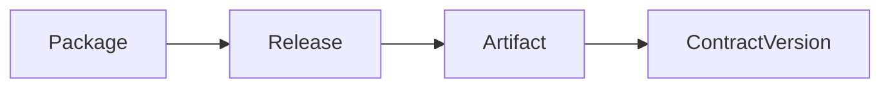

# Catalog Model

The hub models curated source ownership with three user-facing concepts:

- **Package**: the stable catalog identity for a source owner, product, library,
  standard, or example.
- **Release**: an immutable version of that package, pinned to a source repo
  commit or tag and, when available, a manifest hash.
- **Artifact**: one immutable contract version included in a release.

This keeps the database model simple:

## Why There Is No Bundle Table

Some owner repos, such as `xian-dex`, use a bundle manifest because a single
release deploys multiple contracts with roles, source paths, deploy order, and
default chi budgets. The hub still supports that shape, but the bundle is
treated as release metadata rather than a required catalog object.

For example:

- package: `xian-dex`
- release: `0.1.0`, pinned to `contract-bundle.json`, source commit, and
  manifest hash
- artifacts: `con_pairs`, `con_dex`, `con_dex_helper`, `con_lp_token`

Each artifact stores the manifest-facing details that matter for deployment and
verification: role, source path, source hash, deploy order, default chi, and
whether it deploys by default.

This avoids forcing simple one-contract packages to invent an extra bundle
layer, while still preserving enough structure for product-scale releases.

## Source Of Truth

The hub is not the source repository for curated contracts. It stores immutable
published snapshots for browsing, search, review, and deployment workflows.

- Standalone reusable contracts normally come from `xian-contracts`.
- Product systems, such as the DEX, come from their product repos.
- Network-level system packaging belongs in the network/config repo that owns
  that release surface.

Importers should verify pinned owner-repo manifests before writing package
release and artifact records.
